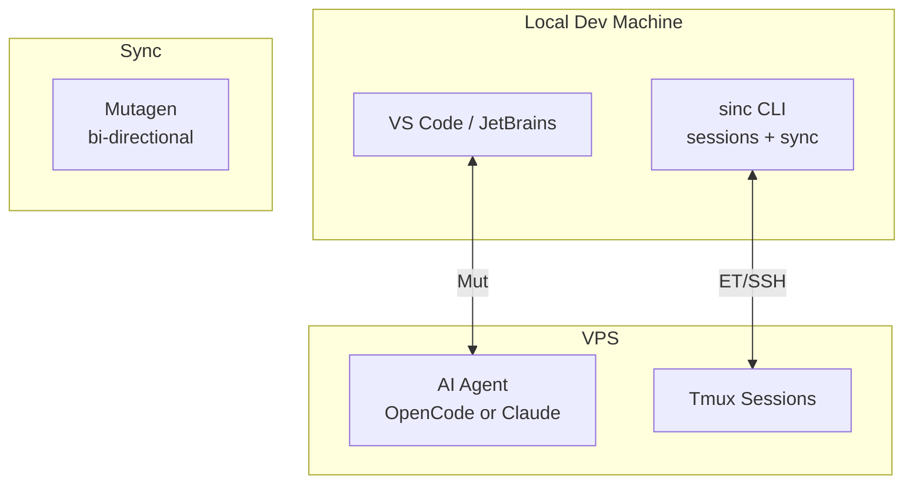

<p align="center">
  <a href="https://github.com/Microck/sincronizado">
    
  </a>
</p>

<p align="center">Edit locally. Run your AI agent on a VPS. Keep files synced.</p>

<p align="center">
  <a href="LICENSE"></a>
  <a href="https://mutagen.io/"></a>
  <a href="https://sincronizado.micr.dev"></a>
</p>

---

## why

local machines have great editors but limited resources. running multiple ai instances locally is intensive and hard to manage while doing other work. cloud vps has compute but terrible latency for editing. _sincronizado_ bridges this: edit locally, execute remotely.

## architecture



## installation

### one-liner install (recommended)

installs the `sinc` cli from github releases.

**linux / macos:**

```bash
curl -fsSL https://sync.micr.dev/install.sh | bash
```

**windows (powershell):**

```powershell
irm https://sync.micr.dev/install.ps1 | iex
```

then run:

```bash
sinc --setup
```

**from source (developer):**

```bash
git clone https://github.com/Microck/sincronizado.git
cd sincronizado
bun install
bun run dev -- --setup
```

### llm agent install

paste this into your ai agent session:

```
install and configure sincronizado by following instructions here:
https://raw.githubusercontent.com/Microck/sincronizado/main/INSTALL.md
```

see [INSTALL.md](./INSTALL.md) for detailed setup options including:

- vps bootstrap with `./scripts/setup-vps.sh`
- troubleshooting

## quick start

### 1. install + setup (one-time)

```bash
curl -fsSL https://sync.micr.dev/install.sh | bash
sinc --setup
```

### 2. connect

from your project directory:

```bash
sinc
```

### 3. manage sessions

```bash
sinc --list
sinc --kill <id>
```

## what you need

local:

- mutagen installed and running

vps:

- ssh access
- `tmux`
- your agent installed (`opencode` or `claude`) and available in `$PATH`

to bootstrap a fresh vps, use:

```bash
sudo ./scripts/setup-vps.sh
```

## cli reference

```bash
sinc --help
sinc --setup
sinc --list
sinc --kill <id>
sinc --uninstall
```

## configuration

```json
{
  "vps": {
    "hostname": "oracle.tail1234.ts.net",
    "user": "ubuntu",
    "port": 22
  },
  "sync": {
    "mode": "both",
    "ignore": [".git", "node_modules", ".next"],
    "remoteBase": "~/workspace"
  },
  "agent": "opencode"
}
```

save as `~/.config/sincronizado/config.json`.

see `docs/configuration.mdx`.

## troubleshooting

| issue         | fix                       |
| ------------ | ------------------------- |
| sync slow    | check `mutagen sync list` |
| ssh fails    | `ssh user@host "echo ok"` |
| setup issues | re-run `sinc --setup`     |

## project structure

```
sincronizado/
├── src/               # `sinc` cli (bun/typescript)
├── docs/              # mintlify docs content
├── scripts/           # vps setup + automation
├── tests/             # bun tests
└── legacy/unused/     # old launcher/installer/packages (not used)
```

## status

v2 cli is merged on `main` and shipped via github releases.

docs: https://sincronizado.micr.dev

## license

mit ᕙ(⇀‸↼‶)ᕗ
