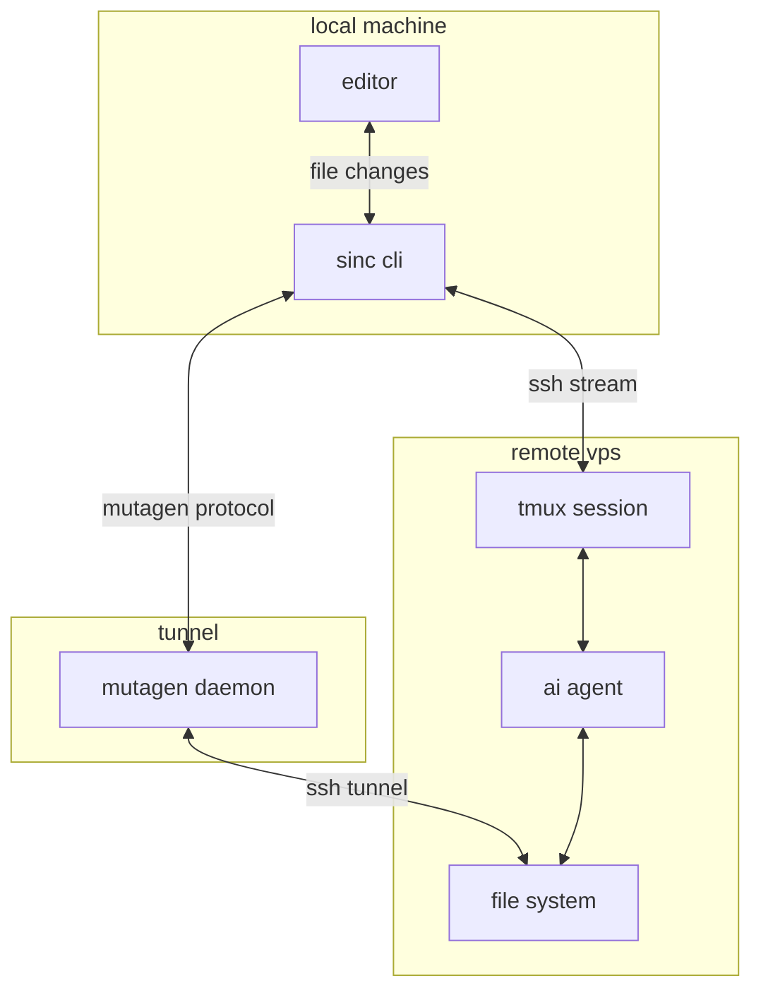

<p align="center">
  <a href="https://github.com/Microck/sincronizado">
    
  </a>
</p>

<p align="center"><strong>edit local. run remote. keep files synced.</strong></p>

<p align="center">
  <a href="LICENSE"></a>
  <a href="https://bun.sh/"></a>
  <a href="https://nodejs.org/"></a>
  <a href="https://sincronizado.micr.dev"></a>
</p>

---

**sincronizado** ("synchronized") is the missing link for ai-native development. it allows you to use your own local files while running your heavy ai agents and code execution on a powerful vps.

## the problem

local machines have good editors but weak compute. running multiple ai agents locally kills battery and blocks your terminal.

vps instances have the compute but editing on them is painful. ssh latency lags. remote connections drop. terminal-only editing is limiting when you need rich gui tools.

## the fix

sincronizado bridges the gap.

1. keep your files on your local machine.
2. sync them instantly to a vps using mutagen.
3. run your ai agent (claude, opencode) on the vps in a persistent tmux session.

you get local speed with server-grade compute.

## workflow scenarios

### scenario a: the "macbook air + h100"
you love macos but need serious gpu power. edit your training script locally. `sinc` pushes it to the vps instantly. you run `python train.py` in the remote session. your laptop stays cool and silent.

### scenario b: the "digital nomad"
bad hotel wifi? no problem. mutagen syncs when the connection allows. tmux keeps your heavy compilation or long-running agent alive even if you disconnect for hours. resume with `sinc -r` exactly where you left off.

### scenario c: the "battery saver"
running `ollama` or huge node builds locally kills battery in 2 hours. offload it all to a cheap hetzner box. keep your local machine purely for editing and browsing.

## what it actually does

`sinc` is the cli for sincronizado. it orchestrates `mutagen`, `ssh`, and `tmux`.

when you run `sinc` in a project folder:
1. checks if a sync session exists. if not, creates one.
2. syncs local files to `~/workspace/<folder_name>` on remote.
3. opens an ssh connection.
4. attaches to a tmux session named after your project.
5. drops you into a shell where your agent is ready to run.

if you disconnect, the session stays alive. run `sinc -r` to reattach. files keep syncing in the background.

## architecture



## installation

### automated (linux / macos)

installs the binary to `~/.local/bin` (or similar) and sets up config.

```bash
curl -fsSL https://sync.micr.dev/install.sh | bash
```

### automated (windows powershell)

requires powershell 5+ and administrative privileges for symlinks if you don't use developer mode.

```powershell
irm https://sync.micr.dev/install.ps1 | iex
```

### manual (from source)

requires `bun` runtime.

```bash
git clone https://github.com/Microck/sincronizado.git
cd sincronizado
bun install
bun run build
# binary is in ./dist/sinc
```

## usage

### initial setup

run this once. it creates `~/.config/sincronizado/config.json`, checks for ssh keys, and sets up your environment.

```bash
sinc --setup
```

**setup features:**
- **vps connection**: configure host, user, and port.
- **ssh keys**: use existing or generate new ed25519 keys.
- **custom alias**: create a shortcut (e.g. type `opencode` to run `sinc`).
- **vps bootstrap**: auto-install tmux and create workspace folders.
- **security hardening**: optional firewall (ufw), fail2ban, and auto-updates setup.

### start a session

navigate to your project. run sync.

```bash
cd ~/my-project
sinc
```

this creates the remote folder `~/workspace/my-project` and starts syncing.

### resume a session

detached? network drop? reattach to the existing tmux session.

```bash
sinc -r
```

### kill a session

stop the sync and kill the remote tmux session.

```bash
sinc --kill <session_name>
```

list active sessions:

```bash
sinc --list
```

## configuration

config lives at `~/.config/sincronizado/config.json`.

example:

```json
{
  "vps": {
    "hostname": "192.168.1.50",
    "user": "ubuntu",
    "port": 22,
    "keyPath": "~/.ssh/id_ed25519"
  },
  "sync": {
    "mode": "two-way-safe",
    "ignore": [
      ".git",
      "node_modules",
      "dist",
      ".next",
      "coverage"
    ],
    "remoteBase": "~/workspace"
  },
  "agent": "opencode"
}
```

### remote base

`remoteBase` defines where projects live on the vps. default is `~/workspace`.
if you sync `~/code/my-app` locally, it lands at `~/workspace/my-app` remotely.

### ignore files

create a `.syncignore` file in your project root to override global ignores. syntax matches `.gitignore`.

```text
# .syncignore
build/
tmp/
*.log
```

## dependencies

local:
- `mutagen`: handles file synchronization. `sinc --setup` attempts to install this.
- `ssh`: standard openssh client.

remote (vps):
- `tmux`: required for session persistence.
- `opencode` or `claude`: the agent you want to run.
- `git`: recommended for version control operations.

bootstrap a fresh vps with our script:

```bash
# runs on your local machine, targets the vps
./scripts/setup-vps.sh
```

## troubleshooting

**sync conflicts**
run `mutagen sync list` to see status. if stuck, run `mutagen sync terminate <id>` and restart `sinc`.

**ssh permission denied**
check your key is loaded: `ssh-add -l`. verify you can ssh manually: `ssh user@host`.

**agent not found**
ensure your agent binary is in the remote `$PATH`. check `.bashrc` or `.zshrc` on the vps.

**latency**
mutagen is fast but big `node_modules` folders slow it down. ignore them in `config.json` or `.syncignore`. run `npm install` on the vps side instead.

## license

MIT ᕙ(⇀‸↼‶)ᕗ
