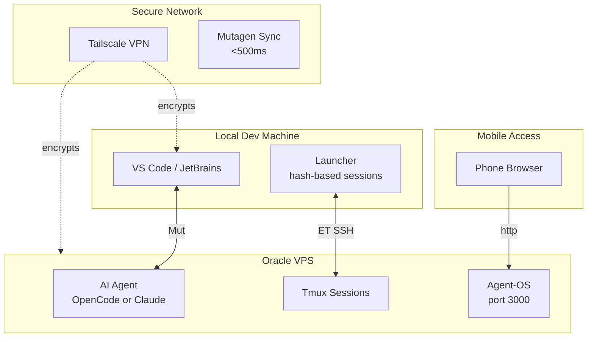

<p align="center">
  <a href="https://github.com/Microck/sincronizado">
    
  </a>
</p>

<p align="center">sincronizado is a hyper-local development stack that runs your AI coding assistant on a VPS for zero friction.</p>

<p align="center">
  <a href="LICENSE"></a>
  <a href="https://bun.sh/"></a>
  <a href="https://nodejs.org/"></a>
  <a href="https://sincronizado.micr.dev"></a>
</p>

---

## why

local machines have great editors but limited resources. running multiple ai instances locally is intensive and hard to manage while doing other work. cloud vps has compute but terrible latency for editing. _sincronizado_ bridges this: edit locally, execute remotely.

## architecture



## installation

### tui installer (recommended)

interactive 8-screen installer. requires [bun](https://bun.sh):

```bash
# clone and run
git clone https://github.com/microck/sincronizado.git
cd sincronizado/installer
bun install
bun run src/index.tsx
```

**features:**

- mode selection (minimal / standard / full / custom)
- ai agent selection (opencode or claude)
- **one-click shell alias setup** - type "opencode" from anywhere
- **opensync integration** - track sessions and token usage
- component checkboxes (discord bot, ai proxy, worktree sessions)
- vps provider templates
- real-time installation progress

### one-liner scripts

for automated setup without interaction:

**linux / macos:**

```bash
curl -fsSL https://sincronizado.micr.dev/install.sh | bash
```

**windows (powershell admin):**

```powershell
iex "& { $(irm https://sincronizado.micr.dev/install.ps1) }"
```

### llm agent install

paste this into your ai agent session:

```
install and configure sincronizado by following instructions here:
https://raw.githubusercontent.com/microck/sincronizado/main/INSTALL.md
```

see [INSTALL.md](./INSTALL.md) for detailed setup options including:

- ssh mcp server for ai-powered vps management
- manual installation steps
- troubleshooting guide

## quick start

### 1. vps setup (one-time)

```bash
ssh ubuntu@your-vps-ip
sudo ./setup-vps.sh --mode=standard
```

### 2. local setup

**with opencode:**

```powershell
# windows
winget install Mutagen.Mutagen
.\launcher\opencode.ps1 -Project myapp

# macos/linux
brew install mutagen
./launcher/opencode.sh -p myapp
```

**with claude code:**

```powershell
# windows
winget install Mutagen.Mutagen
.\launcher\claude.ps1 -Project myapp

# macos/linux
brew install mutagen
./launcher/claude.sh -p myapp
```

### 3. done

- editor syncs via mutagen (<500ms)
- ai runs on vps via eternal terminal
- check status on phone at http://vps:3000

## tiered installation

| mode         | components                            | use case                |
| ------------ | ------------------------------------- | ----------------------- |
| **minimal**  | et, opencode/claude, ufw              | headless servers, ci/cd |
| **standard** | + agent-os, ccmanager, plugins        | **recommended**         |
| **full**     | + kimaki, lunaroute, worktree-session | power users             |
| **custom**   | pick components                       | specific needs          |

### optional components

```bash
--with-kimaki              # discord bot for voice/text control
--with-lunaroute           # ai proxy with token tracking
--with-worktree-session    # git worktree per session
--with-session-handoff     # context continuation
--with-agent-of-empires    # alt to ccmanager (tmux+worktree)

--no-agent-os              # skip web ui
--no-ccmanager             # skip session manager
--no-plugins               # skip opencode plugins
```

## tui installer

requires [bun](https://bun.sh).

```bash
# clone and run
git clone https://github.com/microck/sincronizado.git
cd sincronizado/installer
bun install
bun run src/index.tsx
```

8-screen flow:

1. welcome
2. mode select (minimal/standard/full/custom)
3. addons (checkboxes)
4. vps provider (oracle/hetzner/do/aws)
5. config (hostname, user, root)
6. confirm
7. install (real-time ssh progress)
8. complete

## core components

| tool                 | purpose            | why it matters                        |
| -------------------- | ------------------ | ------------------------------------- |
| **tailscale**        | zero-config vpn    | no port forwarding, secure by default |
| **eternal terminal** | resilient ssh      | survives wifi/5g handoffs             |
| **mutagen**          | bidirectional sync | <500ms file sync                      |
| **opencode/claude**  | ai agent           | the actual ai doing work              |
| **agent-os**         | web ui             | mobile access, session browser        |

## advanced features

### kimaki (discord integration)

```bash
# install
sudo ./setup-vps.sh --with-kimaki

# configure
npx kimaki  # interactive discord bot setup
systemctl start kimaki
```

text your codebase from discord. voice messages transcribed via gemini. each project = channel, each session = thread.

### lunaroute (ai debugging)

```bash
# install
sudo ./setup-vps.sh --with-lunaroute

# run
eval $(lunaroute-server env)
```

proxy all ai calls. track token usage. debug conversations. web ui at port 8082.

### worktree sessions

```bash
# install
sudo ./setup-vps.sh --with-worktree-session

# usage
opencode  # prompts for branch suffix, auto-creates worktree
```

each task gets isolated git worktree. auto-commits on exit. no main branch pollution.

### session handoff

say "handoff" in opencode → new session starts with compact continuation prompt. critical for long sessions on mobile.

## configuration

```json
// .opencode.config.json
{
  "vps": {
    "host": "oracle.tail1234.ts.net",
    "user": "ubuntu",
    "port": 2222
  },
  "sync": {
    "alpha": ".",
    "beta": "~/projects/myapp",
    "ignore": [".git", "node_modules", ".next"]
  }
}
```

see [docs/configuration.md](docs/docs/configuration.md)

## mobile access

agent-os runs on vps port 3000. access via tailscale or expose through nginx.

```bash
# status
systemctl status agent-os

# logs
journalctl -u agent-os -f
```

## troubleshooting

| issue             | fix                              |
| ----------------- | -------------------------------- |
| sync slow         | check `mutagen sync list`        |
| et disconnects    | restart: `systemctl restart et`  |
| agent-os 502      | opencode not running, check logs |
| kimaki offline    | `systemctl restart kimaki`       |
| port 3000 blocked | `ufw allow 3000/tcp`             |

## project structure

```
sincronizado/
├── launcher/          # windows (ps1) + mac/linux (sh)
├── scripts/           # vps setup, rollback
├── installer/         # opentui-based tui
├── config/            # templates
└── docs/              # docusaurus site
```

## status

phases 1-15 complete. v1.1.0 ready.

see [.planning/ROADMAP.md](.planning/ROADMAP.md) for details.

## license

mit ᕙ(⇀‸↼‶)ᕗ
