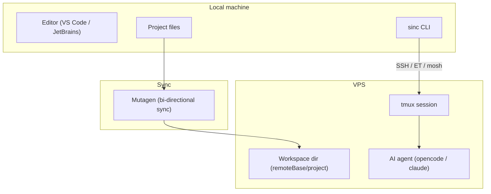

Sincronizado keeps your editor local and moves the AI agent + heavy execution to a VPS.

## High-level diagram

## What happens when you run `sinc`

1. Computes a stable session name from your project path: `sinc-<project>-<hash>`.
2. Starts/attaches a Mutagen sync session.
3. Creates (or resumes) a `tmux` session on the VPS.
4. Runs your chosen agent command (`opencode` or `claude`) inside that session.

## Paths and naming

- **Remote project path:** `${sync.remoteBase}/${projectName}`
- **Session name:** `sinc-${projectName}-${sha256(path).slice(0,6)}`

## Why tmux

tmux gives you session persistence so disconnects don't kill your agent session.
