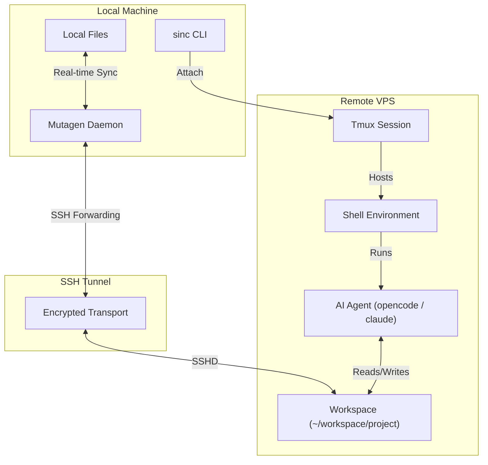

sincronizado is designed to bridge the gap between **local files** (your normal workflow) and **remote execution power** (heavy agents, builds, and compute).

It achieves this by orchestrating three main components: **Mutagen** for file synchronization, **SSH** for secure connectivity, and **Tmux** for session persistence.

## The Big Picture



## Component Deep Dive

### 1. File Synchronization (Mutagen)

We chose [Mutagen](https://mutagen.io/) over other tools like `rsync` or `scp` for several critical reasons:

- **Real-time, Bi-directional Sync**: Unlike `rsync`, which is typically one-way and manual, Mutagen watches your filesystem for changes and syncs them instantly in both directions. If your AI agent writes code on the VPS, it appears locally. If you save a file locally, it appears on the VPS.
- **Latency Compensation**: Mutagen uses a clever differential sync algorithm that works well even over high-latency connections. It doesn't wait for a round-trip confirmation for every byte.
- **Conflict Handling**: In `two-way-safe` mode (the default), Mutagen detects if a file was changed on both sides simultaneously. Instead of blindly overwriting one, it flags a conflict, preventing data loss.

**How it works:**
When you run `sinc`, it checks for an existing Mutagen session named `sinc-<project>-<hash>`. If none exists, it creates one using the `ssh` transport. This means Mutagen tunnels its traffic through your existing SSH connection—no extra ports or firewalls to open.

### 2. Connectivity (SSH)

SSH is the backbone of sincronizado. It's used for:

- **Control Plane**: `sinc` runs commands on the VPS (like `mkdir`, `tmux ls`, `command -v`) via non-interactive SSH.
- **Data Plane**: The Mutagen sync stream is tunneled over SSH.
- **Interactive Plane**: When you "connect", `sinc` actually executes an SSH command that attaches to the remote tmux session.

**Security Model:**
- **Standard SSH Auth**: sincronizado uses your existing SSH configuration (`~/.ssh/config`) and keys. It doesn't invent its own auth.
- **No Agent Forwarding**: By default, we do *not* enable SSH agent forwarding. This is a security best practice to prevent a compromised VPS from accessing your other servers or GitHub account.
- **Socket Permissions**: Mutagen creates a Unix domain socket for communication, protected by standard file permissions.

### 3. Session Persistence (Tmux)

The AI agents we run (like `opencode` or `claude`) are long-running interactive processes. If we just ran them directly over SSH, a network blip or closing your laptop lid would kill the process and lose your context.

**Enter Tmux:**
- **Detached State**: The agent actually runs inside a `tmux` server on the VPS.
- **Reattachable**: When your network drops, the `tmux` session stays alive. `sinc` simply reconnects and reattaches you to the *exact same* terminal state.
- **Background Processing**: You can detach from the session (Ctrl+B, D) and the agent will keep running, thinking, or installing dependencies in the background.

## The Connection Lifecycle

When you type `sinc` in your terminal:

1.  **Identity Check**: sincronizado calculates a unique "Session ID" based on your *absolute local directory path*. This ensures that `~/code/project-a` always maps to the same remote session, even if you rename the folder on the VPS.
2.  **Health Check**: It runs `ssh <host> echo ok` to verify connectivity.
3.  **Bootstrap**: It ensures `~/workspace/<project-name>` exists on the remote.
4.  **Sync Check**: It queries the Mutagen daemon. Is there a sync session for this project?
    -   *No*: Create one. Mutagen installs a small binary agent on the remote end automatically.
    -   *Yes*: Ensure it's healthy.
5.  **Tmux Check**: It checks for a tmux session named `sinc-<project>-<hash>`.
    -   *No*: Create a new session and send the agent startup command (e.g., `opencode`) to it.
    -   *Yes*: Do nothing (it's already running).
6.  **Attach**: It replaces your current process with an SSH client attached to that tmux session.

## why not a fully remote editor?

remote editor integrations can be great, but sincronizado optimizes for keeping your files local. you keep your normal local-file workflow and use the vps for execution.

## Directory Structure

**Local:**
```text
~/projects/my-app/  <-- You run 'sinc' here
├── .git/
├── src/
└── ...
```

**Remote:**
```text
~/workspace/        <-- defined by 'sync.remoteBase'
└── my-app/         <-- synced copy
    ├── .git/       <-- (usually ignored)
    ├── src/
    └── ...
```

By default, we ignore `.git` to prevent repo corruption, and `node_modules` to save bandwidth (you should run `npm install` on the VPS).
