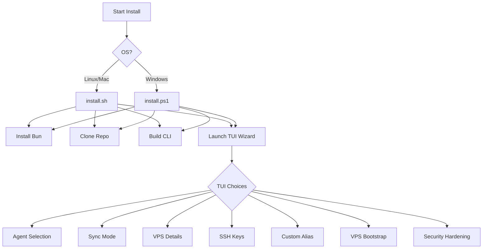

sincronizado is a single binary executable, but it relies on a few external tools to work its magic.

## Supported Platforms

- **macOS** (Intel & Apple Silicon)
- **Linux** (x64 & ARM64)
- **Windows** (via PowerShell or WSL2)

## Installation Flow



## Automated Installation

The easiest way to install is via our shell script. This script detects your OS, downloads the correct binary from GitHub Releases, and puts it in your PATH.

### macOS / Linux

```bash
curl -fsSL https://sync.micr.dev/install.sh | bash
```

**What this does:**
1.  Downloads the latest `sinc` binary to `~/.local/bin/` (or `/usr/local/bin` if you use sudo).
2.  Attempts to add that directory to your `$PATH` in `.bashrc` or `.zshrc`.
3.  Checks for dependencies (`mutagen`).
4.  Launches the interactive setup wizard (`sinc --setup`).

### Windows (PowerShell)

Requires PowerShell 5.0+ and administrative privileges (to create symlinks, unless Developer Mode is enabled).

```powershell
irm https://sync.micr.dev/install.ps1 | iex
```

## Manual Installation

If you prefer to install manually or the script fails:

1.  **Download the Binary**: Go to the [GitHub Releases page](https://github.com/Microck/sincronizado/releases/latest) and download the archive for your OS/Arch.
    -   `sinc-linux-x64.zip`
    -   `sinc-macos-arm64.zip`
    -   etc.
2.  **Unzip**: Extract the executable (`sinc` or `sinc.exe`).
3.  **Move to PATH**: Move the binary to a location in your system `$PATH`.
    -   Linux/Mac: `/usr/local/bin/` or `~/.local/bin/`.
    -   Windows: A folder like `C:\Program Files\sinc\` and add it to your User PATH environment variable.
4.  **Verify**: Open a new terminal and run `sinc --version`.

## Interactive Setup Options

After installation, you run `sinc --setup`. Here is every option available in the wizard:

1.  **AI Agent**: Choose `opencode` (recommended) or `claude`.
2.  **Sync Mode**:
    -   `both`: Two-way sync (default).
    -   `pull`: VPS changes overwrite local.
    -   `push`: Local changes overwrite VPS.
    -   `none`: Disable file sync (ssh/tmux only).
3.  **VPS Connection**: Hostname (IP/domain), User, and Port.
4.  **SSH Key**: Use an existing key (`~/.ssh/id_ed25519`) or generate a new one.
5.  **Workspace Path**: Where projects live on the VPS (default: `~/workspace`).
6.  **Custom Alias**: Create a shortcut command (e.g. `opencode`) to run `sinc`.
7.  **VPS Setup**: Automatically install `tmux` and create directories on the remote server.
8.  **Security Hardening**: Optionally run a hardening script to set up a firewall (UFW), Fail2Ban, and automatic updates.

## Installing Dependencies

sincronizado requires **Mutagen** locally to handle file synchronization.

### 1. Mutagen (Required)

**The easy way:**
Run `sinc --setup`. It will attempt to download and install Mutagen automatically if it's missing.

**The manual way:**
If automatic installation fails, install Mutagen via your package manager:

-   **macOS**: `brew install mutagen-io/mutagen/mutagen`
-   **Linux**: Download from [Mutagen Releases](https://github.com/mutagen-io/mutagen/releases), extract `mutagen`, and move it to `/usr/local/bin`.
-   **Windows**: `winget install Mutagen.Mutagen` or `choco install mutagen`.

### 2. SSH Client (Required)

You almost certainly already have this.
-   **Linux/Mac**: `openssh-client` (pre-installed).
-   **Windows**: `OpenSSH Client` (enable via "Optional Features" if missing).

## Troubleshooting Installation

### "Command not found: sinc"
This means the directory where `sinc` was installed is not in your shell's `$PATH`.
-   **Fix**: Add `export PATH="$HOME/.local/bin:$PATH"` to your `~/.bashrc` or `~/.zshrc`, then restart your terminal.

### "Mutagen not found"
Run `mutagen version` to check. If it fails, install Mutagen manually using the steps above. Note that Mutagen v0.17+ is required.

### Windows: "Script execution disabled"
If PowerShell complains about execution policies, run:
```powershell
Set-ExecutionPolicy -ExecutionPolicy RemoteSigned -Scope CurrentUser
```

### Windows: "Symlink permission denied"
Mutagen requires symlink permissions on Windows.
-   **Fix 1**: Enable "Developer Mode" in Windows Settings -> Update & Security -> For developers.
-   **Fix 2**: Run your terminal as Administrator (not recommended for daily use).
