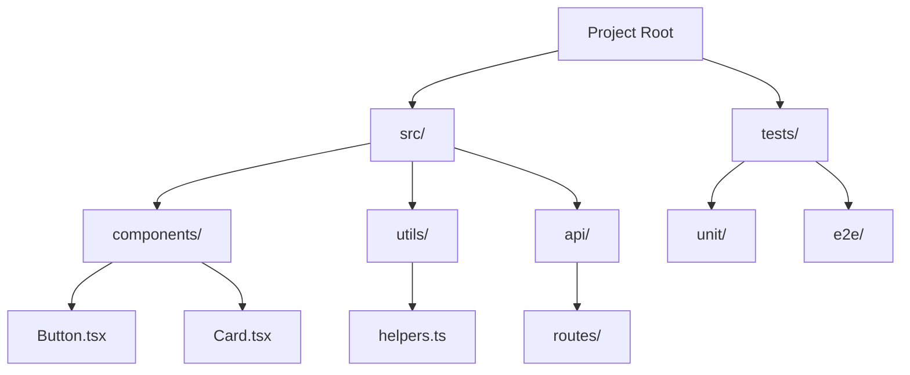
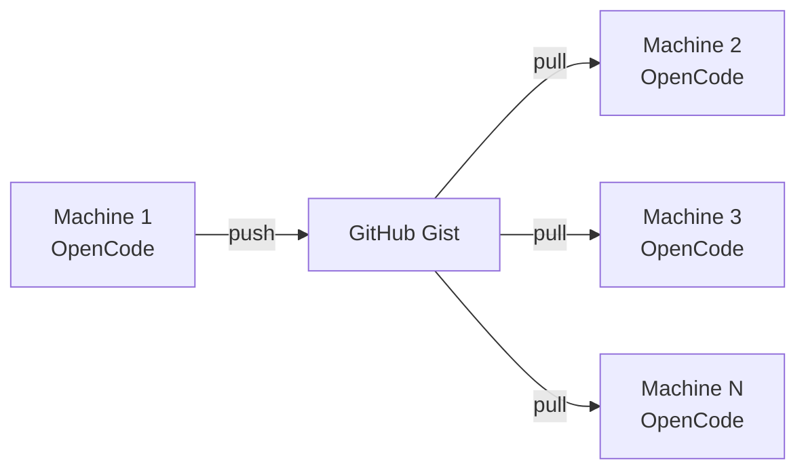
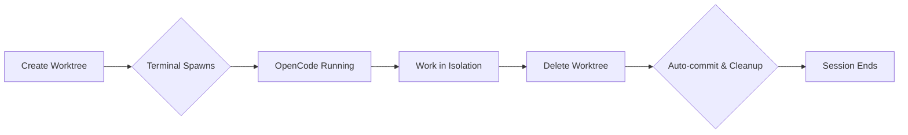
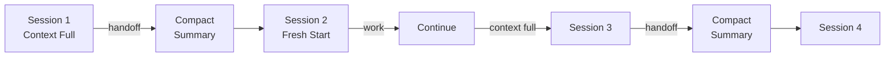
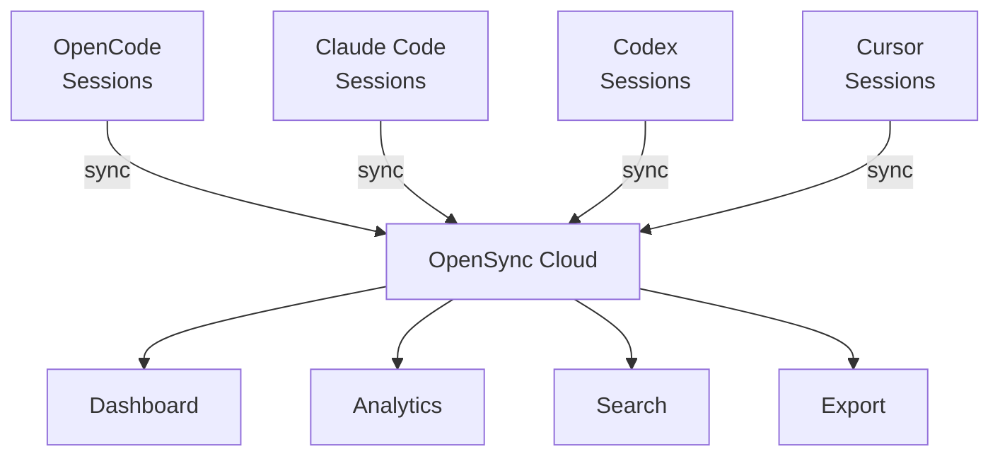

Complete guide to installing and using OpenCode and Claude Code plugins with sincronizado.

## Core plugins (standard mode)

These plugins are installed by default in standard mode and higher.

### opencode-direnv (simonwjackson)

**[https://github.com/simonwjackson/opencode-direnv](https://github.com/simonwjackson/opencode-direnv)**

Purpose: auto-load env vars from `.envrc` when entering directories.


Install:

```bash
# included in VPS setup script
# or install manually:
git clone https://github.com/simonwjackson/opencode-direnv.git ~/.config/opencode/plugins/direnv
```

Usage:

1. Create `.envrc` in project root:

```bash
export API_KEY=example
export DATABASE_URL=postgres://localhost/db
```

2. Run `direnv allow`
3. Variables auto-load when you enter the directory

### agentmap (remorses)

**[https://github.com/remorses/agentmap](https://github.com/remorses/agentmap)**

Purpose: tree view of codebase for better context in headless VPS environments.



Install:

```bash
# included in VPS setup script
git clone https://github.com/remorses/agentmap.git ~/.config/opencode/plugins/agentmap
```

Usage:

- Type `map` or `tree` in OpenCode to see project structure
- Helps AI understand full codebase layout

### opencode-sync (tctinh)

**[https://github.com/tctinh/opencode-sync](https://github.com/tctinh/opencode-sync)**

Purpose: sync OpenCode settings and history across machines via GitHub Gist.



Install:

```bash
# included in VPS setup script
git clone https://github.com/tctinh/opencode-sync.git ~/.config/opencode/plugins/sync
```

Setup:

1. Create GitHub PAT with `gist` scope
2. Run `opencode sync login` and enter token
3. Push: `opencode sync push`
4. On new machine: `opencode sync pull`

### ai-sessions-mcp (yoavf)

**[https://github.com/yoavf/ai-sessions-mcp](https://github.com/yoavf/ai-sessions-mcp)**

Purpose: search and reference past OpenCode sessions.

Install:

```bash
# included in VPS setup script
git clone https://github.com/yoavf/ai-sessions-mcp.git ~/.config/opencode/plugins/ai-sessions
```

Usage:

- `search "previous work on auth"` - find relevant past sessions
- `session:last` - reference last session context

## Session management

### ccmanager (kbwo)

**[https://github.com/kbwo/ccmanager](https://github.com/kbwo/ccmanager)**

Purpose: visual session manager with real-time status indicators.


Install:

```bash
# included in VPS setup (unless --no-ccmanager)
npm install -g @kbwo/ccmanager
```

Usage:

- `ccmanager` - launch interactive TUI
- `ccmanager list` - list all sessions
- Shows status: busy / waiting / idle per session

### agent-of-empires (njbrake)

**[https://github.com/njbrake/agent-of-empires](https://github.com/njbrake/agent-of-empires)**

Purpose: alt session manager using tmux + git worktrees.


Install:

```bash
# via TUI: select it during install
# (run `curl -fsSL https://sync.micr.dev/install.sh | bash` and pick Custom/Full)

# manual VPS setup:
sudo ./scripts/setup-vps.sh --with-agent-of-empires --no-ccmanager

# or manually
curl -fsSL https://raw.githubusercontent.com/njbrake/agent-of-empires/main/install.sh | bash
```

Note: mutually exclusive with ccmanager.

## Optional plugins (full/custom)

### opencode-worktree-session (felixAnhalt)

**[https://github.com/felixAnhalt/opencode-worktree-session](https://github.com/felixAnhalt/opencode-worktree-session)**

Purpose: automatic git worktree per OpenCode session with auto-cleanup.



Install:

```bash
# installed if selected in TUI (full/custom) or enabled in manual VPS setup:
# sudo ./scripts/setup-vps.sh --with-worktree-session
npm install -g @tmegit/opencode-worktree-session
```

Configure in `opencode.json`:

```json
{
  "plugin": ["@tmegit/opencode-worktree-session"]
}
```

Flow:

1. Run `opencode`
2. Prompt asks for branch suffix (example: `feature-auth`)
3. Plugin creates `opencode/feature-auth` branch + worktree
4. AI works in isolated env
5. On exit: auto-commits, pushes branch, removes worktree

Benefits:

- No main branch pollution
- Each task in isolated branch
- Auto cleanup
- Refuses to run on main (safety)

### opencode-session-handoff

**[https://github.com/microck/opencode-session-handoff](https://github.com/microck/opencode-session-handoff)**

Purpose: compact continuation when sessions hit context limit.



Configure in `opencode.json`:

```json
{
  "plugin": ["opencode-session-handoff"]
}
```

Usage:

1. Session fills up
2. Say `handoff`
3. New session starts with continuation prompt

## Plugin configuration

Edit `.opencode.config.json` to enable/disable plugins:

```json
{
  "plugins": {
    "enabled": ["opencode-direnv", "agentmap", "opencode-sync", "ai-sessions-mcp", "ccmanager"]
  }
}
```

For npm-based plugins (worktree-session, session-handoff), add to `opencode.json` instead.

## Claude Code MCP Servers

When using Claude Code (selected in TUI), the VPS setup installs Anthropic's official MCP servers:

### Included MCP servers

- **@anthropic-ai/mcp-server-filesystem** - File operations (read, write, list, search)
- **@anthropic-ai/mcp-server-git** - Git operations (status, diff, log, branch)
- **@anthropic-ai/mcp-server-fetch** - HTTP requests and web fetching

### Configuring MCP servers

Edit `~/.config/claude/settings.json`:

```json
{
  "mcpServers": {
    "filesystem": {
      "command": "npx",
      "args": ["-y", "@anthropic-ai/mcp-server-filesystem", "/home/user/projects"]
    },
    "git": {
      "command": "npx",
      "args": ["-y", "@anthropic-ai/mcp-server-git"]
    },
    "fetch": {
      "command": "npx",
      "args": ["-y", "@anthropic-ai/mcp-server-fetch"]
    }
  }
}
```

### Claude Code-specific features

- **/config** - View and edit configuration
- **/mcp** - List and manage MCP servers
- **MCP tools** - Claude can use filesystem, git, and fetch tools automatically

## Troubleshooting

### Plugin not loading (OpenCode)

1. Check plugin exists in `~/.config/opencode/plugins/`
2. Verify plugin name matches enabled list
3. Restart OpenCode session
4. For npm plugins: verify global install with `npm list -g`

### MCP server not working (Claude)

1. Check MCP config: `claude /config`
2. Verify server is installed: `npm list -g @anthropic-ai/mcp-server-filesystem`
3. Check paths in settings.json are correct
4. Restart Claude Code session

## Third-Party Integrations

### OpenSync (Session Analytics)

**[https://www.opensync.dev/](https://www.opensync.dev/)**

[OpenSync](https://www.opensync.dev/) provides cloud-synced dashboards for tracking AI coding sessions across multiple agents including OpenCode and Claude Code.



**Features:**

- Real-time session syncing and tracking
- Token usage analytics and cost monitoring
- Semantic search across sessions
- Export eval datasets (DeepEval, OpenAI Evals)
- Multi-agent support (OpenCode, Claude, Codex, Cursor)

**Integration:**

Install the sync plugin for your AI agent:

```bash
# For OpenCode
npm install -g opencode-sync-plugin
opencode-sync login

# For Claude Code
npm install -g claude-code-sync
claude-code-sync login
```

Add to your agent configuration:

```json
{
  "plugins": ["opencode-sync-plugin"]
}
```

**Why use it with sincronizado:**

- Track all VPS-based AI sessions in one dashboard
- Monitor token costs across multiple projects
- Search historical sessions for context retrieval
- Build eval datasets from production sessions

Learn more at [opensync.dev](https://www.opensync.dev/)

## SSH MCP Server (Optional)

For AI agents to manage your VPS via SSH commands, install the SSH MCP server:

### Installation

```bash
npm install -g @tufantunc/ssh-mcp
```

### Configuration

**OpenCode:**

```json
{
  "mcp": {
    "ssh": {
      "command": ["ssh-mcp"],
      "enabled": true,
      "type": "local",
      "environment": {
        "SSH_HOST": "your-vps.tailnet.ts.net",
        "SSH_USER": "ubuntu",
        "SSH_KEY": "~/.ssh/id_rsa"
      }
    }
  }
}
```

**Claude Code:**

```json
{
  "mcpServers": {
    "ssh": {
      "command": "ssh-mcp",
      "env": {
        "SSH_HOST": "your-vps.tailnet.ts.net",
        "SSH_USER": "ubuntu",
        "SSH_KEY": "~/.ssh/id_rsa"
      }
    }
  }
}
```

### Capabilities

The SSH MCP server allows your AI agent to:

- Execute commands on the VPS
- Check service status (opencode, claude, agent-os)
- Manage files remotely
- Monitor system resources
- Restart services when needed

### Security Notes

- Only use with Tailscale-connected VPS (never expose SSH publicly)
- Use SSH key authentication (not passwords)
- Limit SSH key permissions on VPS
- Store keys in `~/.ssh/` with 0600 permissions

### sync plugin auth fails

1. Regenerate GitHub token with `gist` scope
2. Run `opencode sync login` again
3. Check token not expired

### direnv not loading

1. Ensure `.envrc` exists
2. Run `direnv allow` after changes
3. Check `.envrc` syntax

### worktree-session not activating

1. Verify install: `npm list -g @tmegit/opencode-worktree-session`
2. Check `opencode.json` plugin entry
3. Ensure you are not on main (plugin refuses)

### session-handoff not working

1. Verify `opencode.json` config
2. Say `handoff` (exact)
3. Confirm context actually filled
