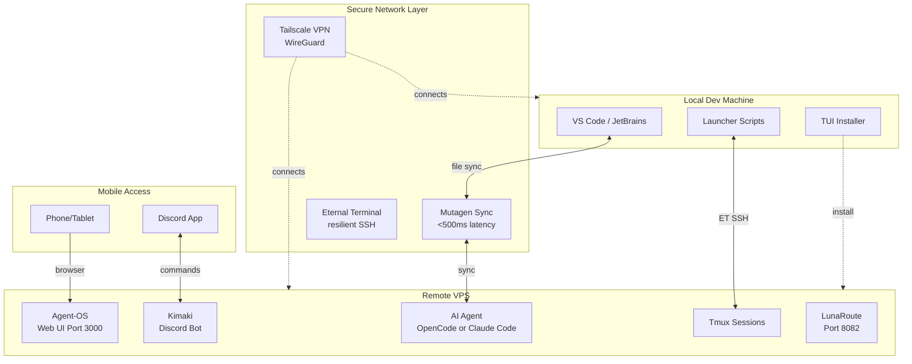
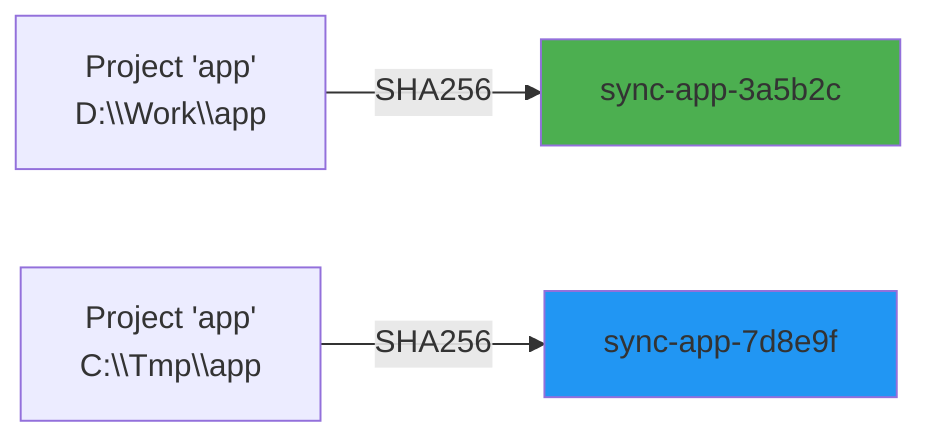
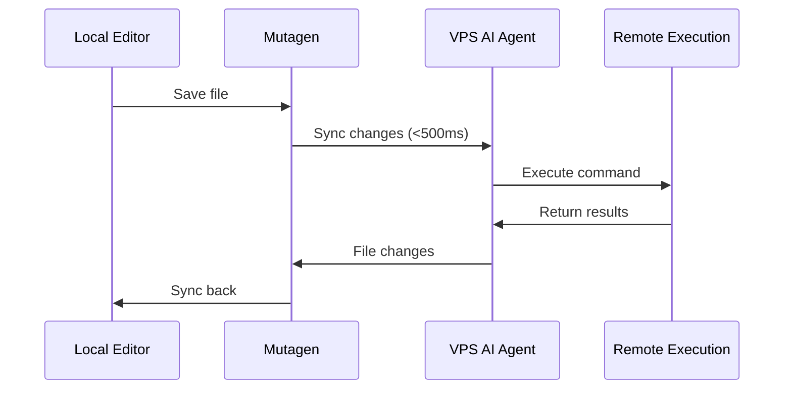

Understanding how Sincronizado works.

Sincronizado creates a seamless bridge between your local development environment and a remote VPS running AI agents.

## Overview

## Installation tiers

Sincronizado supports tiered installation to match your needs.

### Minimal mode

Core only:

- Eternal Terminal (resilient SSH)
- OpenCode (AI agent)
- UFW (firewall)

Use case: headless servers, CI/CD, resource-constrained VPS.

### Standard mode (recommended)

Adds convenience:

- Agent-OS (web UI for mobile access)
- ccmanager (session management TUI)
- OpenCode plugins (direnv, agentmap, sync, ai-sessions)

Use case: daily dev with mobile monitoring.

### Full mode

Adds advanced:

- Kimaki (Discord bot with voice support)
- LunaRoute (AI proxy for debugging)
- Worktree-session (git worktree per task)
- Session-handoff (context continuation)

Use case: power users, team collaboration.

### Custom mode

Pick components via TUI or flags.

Use case: specific requirements, testing new features.

## Components

### File sync (Mutagen)

- Purpose: real-time bidirectional sync
- Performance: &lt;500ms latency
- Ignores: node_modules, .venv, .git
- Conflict resolution: local wins by default

### Network (Tailscale)

- Purpose: zero-config VPN
- Security: WireGuard
- DNS: MagicDNS for easy hostname access
- Mobile: iOS/Android apps

### Persistent shell (Eternal Terminal)

- Purpose: survive network changes
- Reconnect: automatic
- Compatibility: drop-in SSH replacement

### Session management

Hash-based IDs:

Benefits:

- Zero collision even with duplicate project names
- Deterministic based on full path
- 6-char hash for readability

### Mobile (Agent-OS)

- Web UI: port 3000
- View output, manage sessions

## Optional components (full mode)

### Kimaki (Discord)

- Purpose: control agents via Discord
- Features: text commands, voice transcription, file attachments
- Security: role-based access ("Kimaki" role)

### LunaRoute

- Purpose: proxy and monitor AI API calls
- Features: token tracking, session recording, cost analysis
- Web UI: port 8082
- Perf: &lt;0.5ms overhead

### Git worktree sessions

- Purpose: isolated development per task
- Features: auto-creates worktree per session, auto-commits on exit
- Safety: refuses to run on main
- Cleanup: removes worktree after session ends

## Data flow

1. Local edit -> Mutagen detects change
2. Sync -> file pushed to VPS in &lt;500ms
3. Agent notices -> AI sees updated code
4. Remote execution -> heavy work runs on VPS
5. Results sync -> output files return locally

## Security

- VPN: all traffic encrypted via Tailscale
- No open ports: access via VPN by default
- Session isolation: each project in separate tmux session
- No secrets in repo: config stored locally only

## Performance

| Metric          | Target    | Achieved |
| --------------- | --------- | -------- |
| File Sync       | &lt;500ms | yes      |
| Session Connect | &lt;2s    | yes      |
| Network Handoff | seamless  | yes      |
| Mobile Access   | &lt;1s    | yes      |

## Performance targets

| Metric          | Target    |
| --------------- | --------- |
| File Sync       | &lt;500ms |
| Session Connect | &lt;2s    |
| Mobile Access   | &lt;1s    |

## Troubleshooting

See [Troubleshooting](/troubleshooting).
